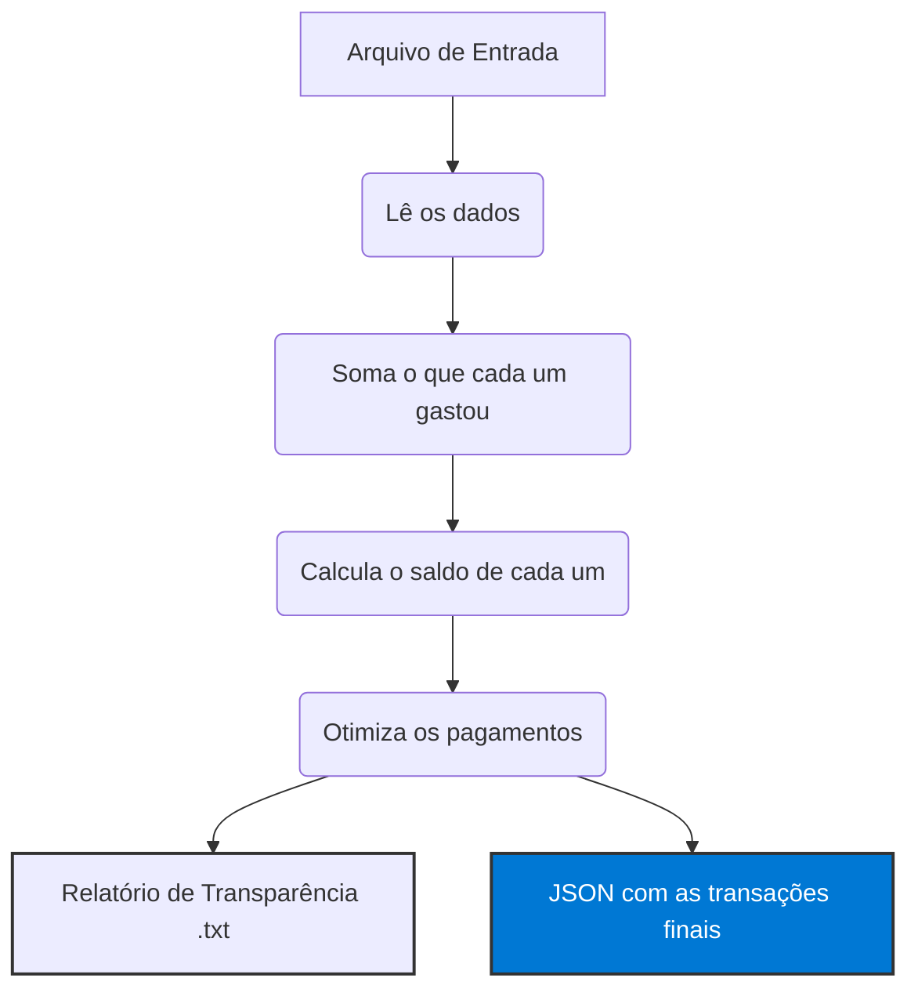

# 💸 RachaInteligente

Cansado de fazer conta de padaria depois do churrasco? O **RachaInteligente** resolve a bagunça. 

Esta API foi feita para quem quer dividir gastos sem dor de cabeça. O grande diferencial? Ela não só divide a conta, mas calcula o **caminho mais curto** para todo mundo se pagar, garantindo o menor número possível de transferências entre os amigos.

Além de te dizer quem paga quem, o sistema gera um "relatório de transparência" em .txt para ninguém desconfiar dos cálculos.

---

## 🚀 O que ele faz?

*   **Inteligência Financeira**: Usa um algoritmo que conecta as maiores dívidas aos maiores créditos.
*   **Transparência Total**: Gera um log detalhado explicando o "passo a passo" matemático.
*   **Simplicidade**: Aceita arquivos JSON ou CSV e resolve tudo em segundos.

---

## ⚙️ Como a mágica acontece

O fluxo foi desenhado para ser rápido e preciso:



### Por que esse fluxo é eficiente?
1.  **Consolidação**: Primeiro, entendemos o "retrato geral". Não importa se você pagou 10 vezes, o sistema foca no seu saldo final.
2.  **Saldo Líquido**: Identificamos quem é credor e quem é devedor.
3.  **Minimização (Greedy)**: O algoritmo prioriza quitar as maiores dívidas primeiro, o que reduz drasticamente o número de PIXs no grupo.

---

## 📁 Arquivos de Exemplo

Para testar a API, você pode usar os arquivos de exemplo que deixamos prontos na pasta `.docs`:

*   [📄 Exemplo em JSON](.docs/despesas_mock.json)
*   [📊 Exemplo em CSV](.docs/despesas_mock.csv)

---

## 🛠️ Tecnologias

*   **.NET 10** (Alta performance)
*   **Scalar UI** (Interface amigável para testar a API)

---

## 📁 Como usar

1.  Tenha o SDK do .NET 10 instalado.
2.  Clone o projeto e rode:
    ```bash
    dotnet run --project RachaInteligente
    ```
3.  Acesse `/scalar/v1` no seu navegador e suba seu arquivo de despesas.

---

*Nota: No final de cada cálculo, você recebe um arquivo .txt. Ele é a sua "prova real" para mostrar no grupo do WhatsApp.*