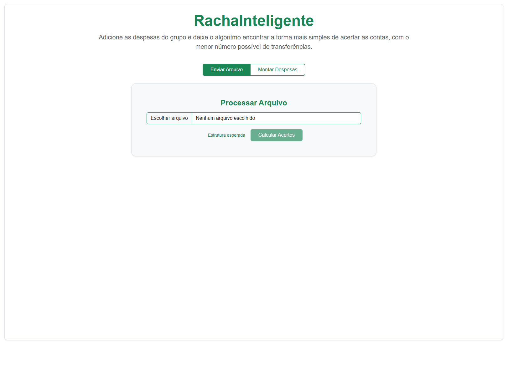
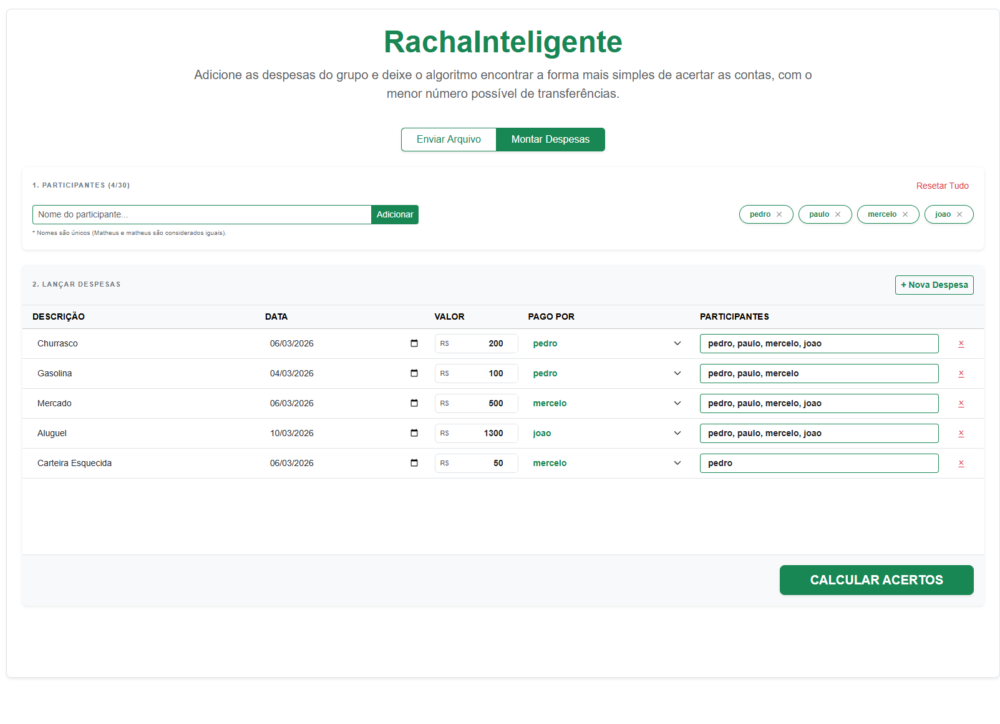
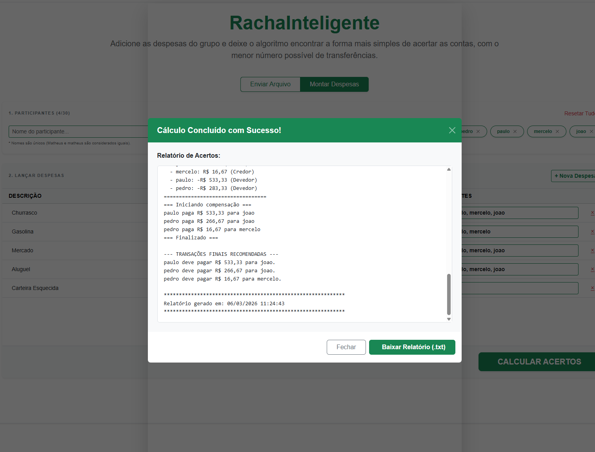
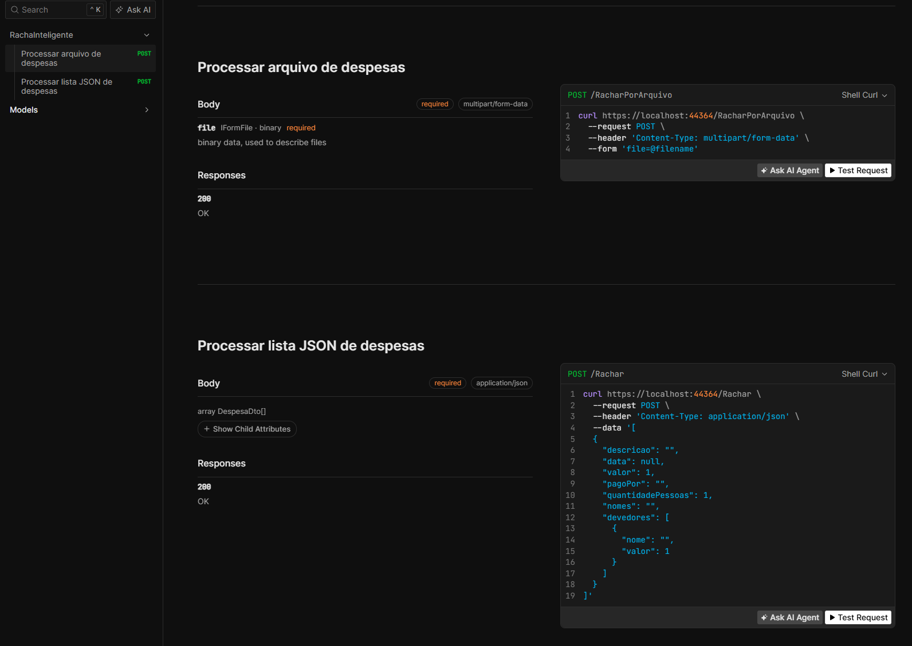
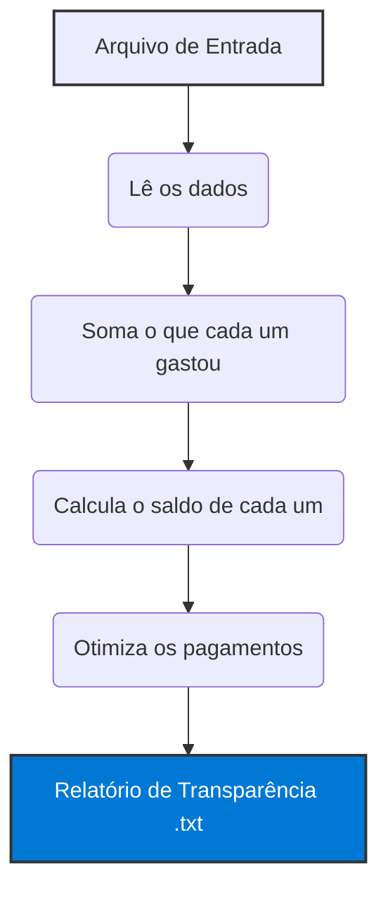

# 💸 Racha Inteligente
Cansado de fazer conta de padaria depois do churrasco? O **Racha Inteligente** resolve a bagunça. 
Esta API foi feita para quem quer dividir gastos sem dor de cabeça. O grande diferencial? Ela não só divide a conta, mas calcula o **caminho mais curto** para todo mundo se pagar, garantindo o menor número possível de transferências entre os amigos.
Além de te dizer quem paga quem, o sistema gera um "relatório de transparência" em .txt para ninguém desconfiar dos cálculos.

---

## 🚀 O que ele faz?
*   **Inteligência Financeira**: Usa um algoritmo que conecta as maiores dívidas aos maiores créditos.
*   **Transparência Total**: Gera um log detalhado explicando o "passo a passo" matemático.
*   **Simplicidade**: Aceita entrada manual pela interface ou arquivos JSON/CSV e resolve tudo em segundos.

---

## 📸 Demonstração

Confira abaixo como é a interface do **Racha Inteligente** em ação:

### 1. Processamento por Arquivo
Arraste e solte seu arquivo CSV ou JSON para processar dezenas de despesas instantaneamente.


### 2. Montagem Manual de Despesas
Interface intuitiva para adicionar participantes e lançar gastos um a um, com seleção inteligente de quem participou de cada item.


### 3. Resultado Otimizado
O algoritmo calcula o menor número de transferências e gera um relatório detalhado.


### 4. Documentação da API (Scalar)
Endpoints documentados e prontos para testes rápidos via interface Scalar.


---

## ⚙️ Como a mágica acontece
O fluxo foi desenhado para ser rápido e preciso:


```mermaid
graph TD
    A[Arquivo de Entrada] --> B(Lê os dados)
    B --> C(Soma o que cada um gastou)
    C --> D(Calcula o saldo de cada um)
    D --> E(Otimiza os pagamentos)
    E --> F[Relatório de Transparência .txt]
    
    style A stroke:#333,stroke-width:2px
    style F fill:#0078d4,color:#fff,stroke:#333,stroke-width:2px
```

### Por que esse fluxo é eficiente?
1.  **Consolidação**: Primeiro, entendemos o "retrato geral". Não importa se você pagou 10 vezes, o sistema foca no seu saldo final.
2.  **Saldo Líquido**: Identificamos quem é credor e quem é devedor.
3.  **Minimização (Greedy)**: O algoritmo prioriza quitar as maiores dívidas primeiro, o que reduz drasticamente o número de PIXs no grupo.

---

## 📁 Arquivos de Exemplo
Para testar a API, você pode usar os arquivos de exemplo que deixamos prontos na pasta `.docs`:
*   [📄 Exemplo em JSON](.docs/despesas_mock.json)
*   [📊 Exemplo em CSV](.docs/despesas_mock.csv)

### Estrutura esperada

**CSV** — use ponto e vírgula (`;`) como separador:
```
Despesa;Data;Valor;Pago por;Nomes
```

**JSON**:
```json
[
  {
    "descricao": "Churrasco",
    "data": "2024-03-05",
    "valor": 150.00,
    "pagoPor": "Carlos",
    "nomes": "Carlos, João, Maria"
  }
]
```

*Obs: o nome não é case-sensitive, então João, joão e JOÃO serão considerados a mesma pessoa.*

---

## 🛠️ Tecnologias

### Front-end
*   **Blazor WebAssembly (.NET 10 Preview)** — Interface rica e responsiva rodando C# nativamente no navegador via WASM.
*   **Bootstrap 5** — Estilização moderna e componentes responsivos.

### Back-end
*   **ASP.NET Core Web API** — Alta performance para processamento dos cálculos.
*   **Minimal APIs** — Endpoints leves e rápidos.

### Arquitetura e Infraestrutura
*   **Shared Class Library** — DTOs compartilhados entre front e back, garantindo um único contrato de dados.
*   **Docker** — Containerização completa para facilitar o deploy.

---

## 🔌 Endpoints

O projeto oferece duas formas de entrada de dados:

| Endpoint | Método | Descrição |
|---|---|---|
| `/Rachar` | `POST` | Recebe um JSON de `List<DespesaDto>` direto da interface Blazor |
| `/RacharPorArquivo` | `POST` | Recebe upload de arquivo `.csv` ou `.json` para processamento em lote |

---

## 🚀 Como usar

### Opção 1: Docker (Mais fácil)
Se você tem o Docker instalado, basta rodar:
```bash
docker build -t rachainteligente .
docker run -d -p 8080:8080 --name rachainteligente rachainteligente
```
Acesse `http://localhost:8080` no seu navegador.

### Opção 2: Manual (.NET 10)
1.  Tenha o SDK do .NET 10 instalado.
2.  Clone o projeto e rode:
    ```bash
    dotnet run --project RachaInteligente/RachaInteligente.csproj
    ```
3.  Acesse `http://localhost:5298` no seu navegador e cadastre as despesas ou suba o seu arquivo.

---

*Nota: No final de cada cálculo, você recebe um arquivo .txt. Ele é a sua "prova real" para mostrar no grupo do WhatsApp.*
